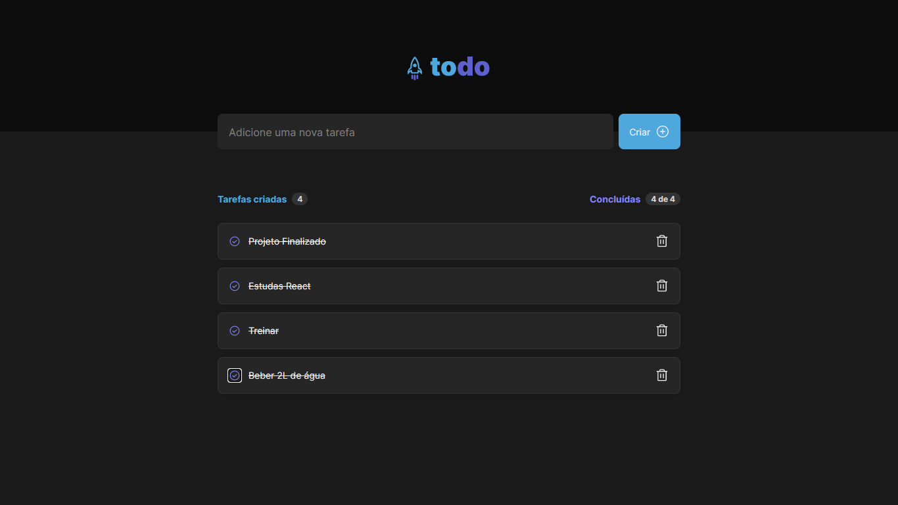

# ToDo List

Uma aplicação web com intuito de gerenciar suas atividades do dia a dia e melhorar seu desempenho.

## 📷 Fotos do Projeto

Home



## 🚀 Começando

Essas instruções permitirão que você obtenha uma cópia do projeto em operação na sua máquina local para fins de desenvolvimento e teste.

### 📋 Pré-requisitos

De que coisas você precisa para instalar o software e como instalá-lo?

```
Você irá precisar do NodeJs instalado em sua máquina e do Git
```

### 🔧 Instalação

Uma série de exemplos passo-a-passo que informam o que você deve executar para ter um ambiente de desenvolvimento em execução.

```
Copiar o link para clonar o repositório: https://github.com/eu-pedro/ToDo-List.git
```

E repita:

```
Abra com o Git/Prompt de Comando a pasta em que o repositório foi clonada e execute git clone https://github.com/eu-pedro/ToDo-List.git
```

```
Execute npm install ou yarn install para instalar as dependências da aplicação e rode um npm run dev para executar a aplicação
```

## 🛠️ Construído com

Mencione as ferramentas que você usou para criar seu projeto

* [React](https://reactjs.org/docs/getting-started.html) - A biblioteca de JavaScript usada
* [TypeScript](https://www.typescriptlang.org/docs/home) - Um superset do JavaScript

## ✒️ Autores

* **Pedro Henrique** - *ToDo List* - [Desenvolvedor Full-Stack](https://www.linkedin.com/in/mepedrohrq/)

## 🎁 Expressões de gratidão

* Agradeço pela oportunidade da Rocketseat pelo incentivo de me desafiar e criar uma aplicação como essa e me parabenizo pelo esforço, dedicação e horas de estudos para finalizar este projeto.
---
Criado por [Pedro Henrique](https://github.com/eu-pedro) 😊